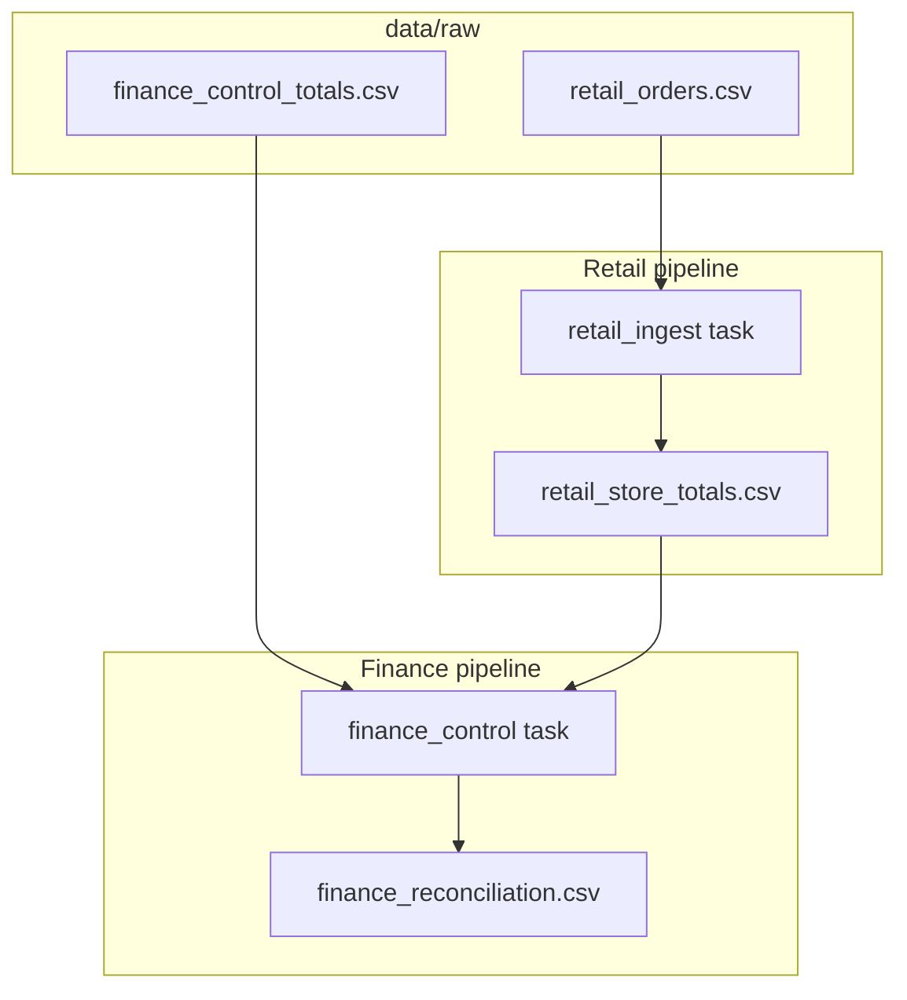
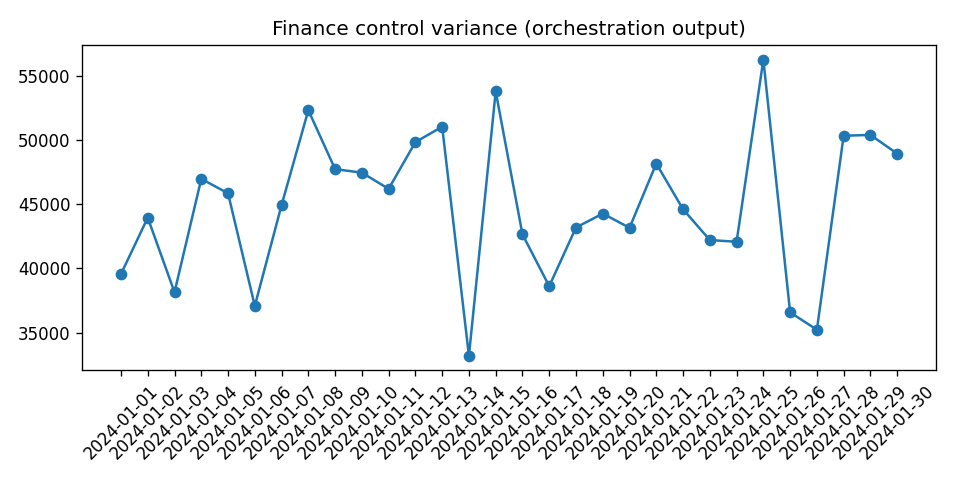

# Prefect Orchestration Lab

**Author:** Faiz Elahi · **Type:** EDUCATIONAL LAB · **Synthetic retail + finance CSVs**

---

## Educational disclaimer / synthetic data

This lab demonstrates **dependency ordering** and **retries** between two pipelines (retail ingest → finance reconciliation). It does **not** require Prefect Cloud, does not configure a production work pool, and may run in **`local_orchestrator`** fallback mode when Prefect imports fail (common on some Windows Python installs).

All store IDs, order amounts, and ledger control totals are **synthetic**. Variance numbers teach reconciliation mechanics, not real corporate ledger sign-off.

---

## Problem statement (detailed)

Data platforms rarely run isolated scripts. Finance expects **control totals**—ledger expectations that must match rolled-up operational facts after retail POS loads complete. Orchestrators (Prefect, Airflow, Dagster) encode:

- **DAG dependencies** (finance waits for retail artifact),
- **Retry policies** on transient failures,
- **Observable task boundaries** for on-call engineers.

Students often write two scripts and manually run them in order. This lab makes the **contract explicit**: finance reconciliation reads `retail_store_totals.csv` produced by retail ingest, compares against `finance_control_totals.csv`, and writes `finance_reconciliation.csv`.

---

## Why this tool

| Manual scripts | Prefect-style flows |
|----------------|---------------------|
| Implicit ordering | Declared `@flow` / task graph |
| Ad hoc retries | Task retry configuration |
| Opaque logs | Task run labels (when Prefect works) |

The included **`local_orchestrator.py`** proves the **business logic** survives even if the orchestration library path fails—useful honesty for portfolios.

---

## Architecture





See: [`docs/architecture.md`](docs/architecture.md)

---

## Dataset dictionary (tables / columns)

### `data/raw/retail_orders.csv`

| Column | Description |
|--------|-------------|
| `order_id` | Synthetic order key |
| `store_id` | Stores `S1`–`S10` |
| `amount_usd` | Order amount |

### `data/raw/finance_control_totals.csv`

| Column | Description |
|--------|-------------|
| `ledger_date` | Daily ledger date |
| `control_total_usd` | Expected control total for reconciliation teaching |

### `data/processed/retail_store_totals.csv` (output)

| Column | Description |
|--------|-------------|
| `store_id` | Store identifier |
| `total_amount_usd` | Sum of orders per store |

### `data/processed/finance_reconciliation.csv` (output)

| Column | Description |
|--------|-------------|
| `ledger_date` | Date aligned to control file |
| `control_total_usd` | From finance control |
| `retail_rollups_usd` | Total retail order amount repeated per ledger row for teaching compare |
| `variance_usd` | `control_total_usd - retail_rollups_usd / row_count` per `src/flows.py` |

---

## Prerequisites

- Python 3.10+
- Packages in `requirements.txt` (Prefect optional at runtime depending on import success)
- No cloud account

---

## Step-by-step: how to run

### Windows PowerShell

```powershell
cd prefect-orchestration-lab
python -m venv .venv
.\.venv\Scripts\Activate.ps1
pip install -r requirements.txt
python scripts/generate_synthetic_data.py
python scripts/run_lab.py
python scripts/render_docs_images.py
```

Watch stdout for **`MODE: prefect`** or **`MODE: local_orchestrator`**.

### Optional bash

```bash
cd prefect-orchestration-lab
python3 -m venv .venv && source .venv/bin/activate
pip install -r requirements.txt
python scripts/generate_synthetic_data.py
python scripts/run_lab.py
python scripts/render_docs_images.py
```

---

## File-by-file walkthrough

| Path | Role |
|------|------|
| `scripts/generate_synthetic_data.py` | Creates raw retail orders + finance control CSVs |
| `src/flows.py` | Prefect `@flow` / `@task` implementation with retries |
| `src/local_orchestrator.py` | Same pipeline logic without Prefect dependency |
| `scripts/run_lab.py` | Tries Prefect path; falls back on exception |
| `scripts/render_docs_images.py` | Variance visualization for docs |
| `data/processed/` | Generated artifacts (may exist in repo from prior runs) |

**Ordering invariant:** retail processed file must exist before finance reconciliation task consumes it.

---

## Expected outputs and how to interpret them

| Signal | Meaning |
|--------|---------|
| `MODE: prefect` | Prefect import and flow execution succeeded locally |
| `MODE: local_orchestrator` | Fallback path; compare logs to ensure same CSV outputs |
| `finance_reconciliation.csv` | Non-zero `variance_usd` may appear—discuss tolerance thresholds in class |
| `docs/images/variance.png` | Visual variance for slides |

Open reconciliation CSV and relate **`variance_usd`** to synthetic generator parameters—this is not materiality testing for SEC filings.

---

## Results interpretation

- **Small variances** can still be “failures” if policy says zero tolerance—discuss threshold tasks as extensions.
- **Fallback mode** is not HA—no distributed workers, no Prefect Cloud UI.
- Retail rollup **depends on all stores** unless you add exercise filters.

---

## Glossary (8+ terms)

1. **Flow** — Top-level orchestrated workflow entrypoint.
2. **Task** — Retryable unit of work inside a flow.
3. **DAG** — Directed acyclic graph of dependencies.
4. **Control total** — Finance checksum compared to rolled-up facts.
5. **Reconciliation** — Process of explaining differences between sources.
6. **Variance** — Numeric gap between expected and observed totals.
7. **Retry policy** — Automatic re-execution after transient errors.
8. **Orchestrator** — System scheduling and tracking pipeline runs.
9. **Idempotency** — Safe reruns; discuss whether tasks overwrite or append processed files.

---

## Common mistakes (5+)

1. Running **finance before retail** artifact exists (orchestration should prevent; manual CSV deletes break this).
2. Assuming **Prefect Cloud** is configured—local direct run only here.
3. Ignoring **MODE line** in stdout when debugging environment issues.
4. Treating synthetic variance as **production incident** without context label.
5. **Pinning Prefect** inconsistently across laptops—document version in README notes.
6. Committing **large processed CSV churn** without noting regenerability.

---

## Exercises (5+)

1. Add **notification task stub** when `abs(variance_usd)` exceeds threshold.
2. Parameterize **store filter** on retail ingest (`store_id` argument).
3. Pin Prefect in clean venv; **diff logs** between Prefect vs local modes.
4. Emit **OpenTelemetry-style span names** in local orchestrator for practice.
5. Wire **`dataset_freshness.json`** pattern from langchain lab before finance runs.
6. Schedule via **Prefect deployment** in personal sandbox (optional advanced).

---

## Limitations / simulation vs production

| This lab | Production orchestration |
|----------|---------------------------|
| Local CSV files | Warehouse tables + incremental loads |
| Single machine | K8s agents, work pools |
| Optional Prefect UI | RBAC, audit, alerting integrations |
| Simple retry | Exponential backoff, circuit breakers |

Broken Prefect installs forcing fallback are **documented behavior**, not hidden failures.

---

## Related labs

- [`langchain-langgraph-analyst-lab`](../langchain-langgraph-analyst-lab/) — Downstream “analyst” on refreshed datasets.
- [`databricks-lakehouse-medallion-lab`](../databricks-lakehouse-medallion-lab/) — Medallion layers instead of retail/finance CSV chain.
- [`dbt-healthcare-marts-lab`](../dbt-healthcare-marts-lab/) — SQL transforms with `dbt run` as orchestration cousin.
- [`retail-demand-basket-lab`](../retail-demand-basket-lab/) — More retail analytics depth.

---

**Author:** Faiz Elahi · Educational use only.
